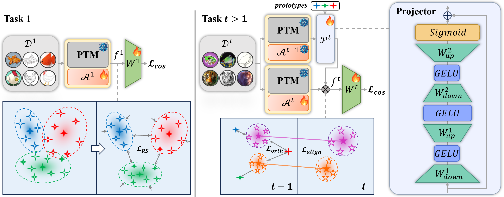

# Representation-Steered Incremental Adapter-Tuning for Class-Incremental Learning with Pre-Trained Models

  

This repository serves as the official implementation corresponding to the paper titled "Representation-Steered Incremental Adapter-Tuning for Class-Incremental Learning with Pre-Trained Models". 


## Installation
### Requirements
Ubuntu 20.04 LTS

Python 3.10

CUDA 11.8

Detailed package information and corresponding versions are available in the requirements.txt file.

### Data preparation

The overall directory structure should be:
```
RSIAT/
├──data/
├──datasets/
│   ├──cifar-100-python/
│   ├──cub/
│   ├──imagenet-a/
│   ├──imagenet-r/
│   ├──omnibenchmark/
│   ├──vtab/
│   ......
├──.......
```

## Training and evaluation

The training and evaluation instructions for each dataset are in the "./args.sh" file. Each dataset can be calculated separately, and the results are stored in the "./logs" folder.

### Checkpoint and resume

Each experiment configuration now saves a checkpoint after every completed incremental task. Checkpoints are isolated by seed and stored at:

```
ckpt/<prefix>/<dataset>/<init_cls>_<increment>/seed_<seed>/task_<N>.pkl
```

The default configurations keep only the most recent checkpoint to reduce disk use. To resume a stopped run, set the following in the same JSON configuration and run the original command again:

```json
{
  "resume": true
}
```

Optionally set `"resume_path"` to a specific `task_N.pkl`, `"keep_last_checkpoint": false` to retain every task checkpoint, or `"max_tasks_per_run"` to stop cleanly after a fixed number of tasks. Resume requires the same dataset, seed, class order, initial/incremental class split, model, and backbone. Checkpoints are task-boundary snapshots; they do not resume an interrupted epoch. The supplied configurations retain full covariance (`"compact_diagonal_checkpoint": false`) for an exact task-boundary resume; enable the compact diagonal form only when Drive space matters, since it drops covariance cross-terms used by classifier alignment.

### Efficient training

`eval_interval: 0` and `ca_eval_interval: 0` evaluate only the final epoch of each training stage. This avoids repeated full validation passes without changing gradients, optimizer steps, or the cosine scheduler. Set either value to a positive number when intermediate validation curves are needed. `num_workers`, `stats_num_workers`, `pin_memory`, and `persistent_workers` configure data loading; the provided values are suitable starting points for a GPU runtime.

For a Google Colab smoke test that verifies data loading, training, checkpoint creation, and resume at task 1, use [RSIAT_Colab.ipynb](RSIAT_Colab.ipynb).

## Citation

If you find this useful in your research, please consider citing:

```text
@inproceedings{zhao2026representation,
  title={Representation-Steered Incremental Adapter-Tuning for Class-Incremental Learning with Pre-Trained Models},
  author={Zhao, Jiarui and Huang, Libo and Li, Xiangqi and An, Zhulin and Yang, Chuanguang and Wang, Yu and Diao, Boyu and Xu, Yongjun},
  booktitle={Proceedings of the IEEE/CVF Conference on Computer Vision and Pattern Recognition},
  pages={18010--18020},
  year={2026}
}
```

## Acknowledgement

This repo is based on [PILOT](https://github.com/LAMDA-CL/LAMDA-PILOT) and [SSIAT](https://github.com/HAIV-Lab/SSIAT).

Thanks for their wonderful work!!!
